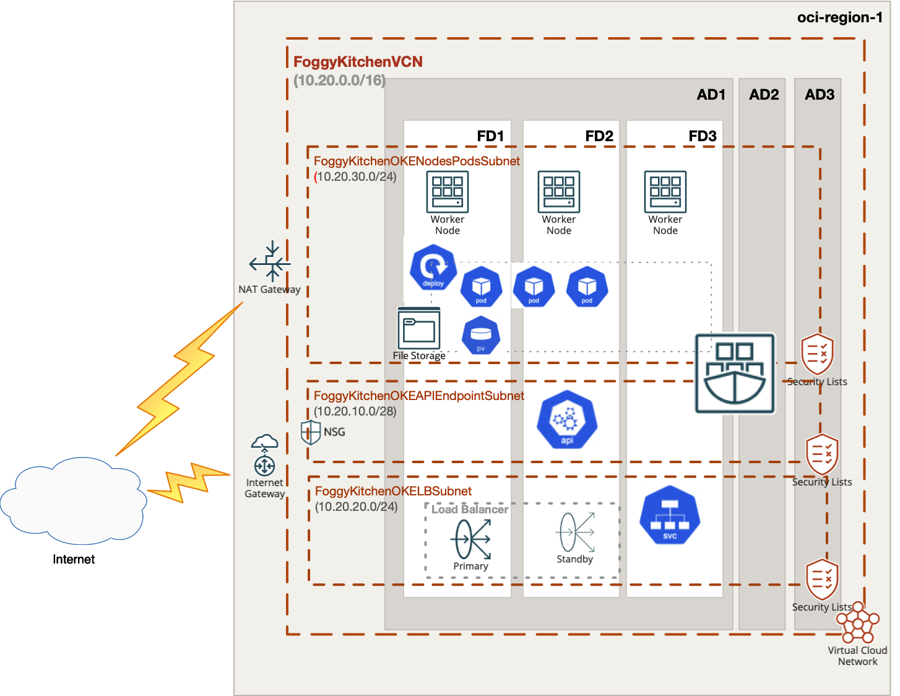

# OCI Container Engine for Kubernetes (aka OCI OKE) with OCI File Storage Service as PVC

## Project description

In this repository, I have documented my hands on experience with Terrafrom for the purpose of Container Engine for Kubernetes (aka OCI OKE) deployment with OCI File Storage Service as PVC. This set of HCL based Terraform files which can customized according to any requirements.  

## Topology Diagram 

With the usage of this example HCL code you can build topology documented by diagram below. This topology is extremly simplified for education purposes and rather cannot be used for production implementations. 



## How to use code 

### Deploy Using Oracle Resource Manager

1. Click [](https://cloud.oracle.com/resourcemanager/stacks/create?region=home&zipUrl=https://github.com/mlinxfeld/terraform-oci-oke-pvc-fss/releases/latest/download/terraform-oci-oke-pvc-fss-stack-latest.zip)

    If you aren't already signed in, when prompted, enter the tenancy and user credentials.

2. Review and accept the terms and conditions.

3. Select the region where you want to deploy the stack.

4. Follow the on-screen prompts and instructions to create the stack.

5. After creating the stack, click **Terraform Actions**, and select **Plan**.

6. Wait for the job to be completed, and review the plan.

    To make any changes, return to the Stack Details page, click **Edit Stack**, and make the required changes. Then, run the **Plan** action again.

7. If no further changes are necessary, return to the Stack Details page, click **Terraform Actions**, and select **Apply**. 

### Deploy Using the Terraform CLI

#### STEP 1.

Clone the repo from GitHub.com by executing the command as follows and then go to terraform-oci-private-oke-pvc-fss directory:

```
[opc@terraform-server ~]$ git clone https://github.com/mlinxfeld/terraform-oci-oke-pvc-fss.git
Cloning into 'terraform-oci-oke-pvc-fss'...
remote: Enumerating objects: 17, done.
remote: Counting objects: 100% (17/17), done.
remote: Compressing objects: 100% (17/17), done.
remote: Total 17 (delta 0), reused 10 (delta 0), pack-reused 0
Unpacking objects: 100% (17/17), done.

[opc@terraform-server ~]$ cd terraform-oci-oke-pvc-fss/

[opc@terraform-server terraform-oci-oke-pvc-fss]$ ls -latr

drwxr-xr-x  79 opc opc    2528 Jul 20 16:13 ..
drwxr-xr-x  12 opc opc     384 Jul 20 16:13 .git
-rw-r--r--   1 opc opc     292 Jul 20 16:13 compartment.tf
-rw-r--r--   1 opc opc    2154 Jul 20 16:13 oke.tf
-rw-r--r--   1 opc opc      80 Jul 20 16:13 tls.tf
-rw-r--r--   1 opc opc    1474 Jul 21 10:10 fss.tf
drwxr-xr-x   5 opc opc     160 Jul 21 12:30 templates
-rw-r--r--   1 opc opc    1169 Jul 21 13:26 locals.tf
-rw-r--r--   1 opc opc   16310 Jul 21 13:39 network.tf
-rw-r--r--   1 opc opc    2550 Jul 21 13:57 oke_deploy.tf
-rw-r--r--   1 opc opc    2219 Jul 21 14:01 datasources.tf
-rw-r--r--   1 opc opc    6495 Jul 21 14:05 schema.yaml
-rw-r--r--@  1 opc opc  298312 Jul 21 14:13 terraform-oci-oke-pvc-fss.png
-rw-r--r--   1 opc opc     548 Jul 21 15:11 outputs.tf
drwxr-xr-x  24 opc opc     768 Jul 21 15:12 .
-rw-r--r--   1 opc opc    2461 Jul 21 15:14 variables.tf
-rw-r--r--   1 opc opc     743 Jul 21 15:14 provider.tf
-rw-r--r--@  1 opc opc   27041 Jul 21 15:14 README.md
-rw-r--r--   1 opc opc     614 Jul 21 15:16 .gitignore
```

#### STEP 2.

Within web browser go to URL: https://www.terraform.io/downloads.html. Find your platform and download the latest version of your terraform runtime. Add directory of terraform binary into PATH and check terraform version:

```
[opc@terraform-server terraform-oci-oke-pvc-fss]$ export PATH=$PATH:/home/opc/terraform

[opc@terraform-server terraform-oci-oke-pvc-fss]$ terraform --version

Terraform v1.0.0

Your version of Terraform is out of date! The latest version
is 1.2.2. You can update by downloading from https://www.terraform.io/downloads.html
```

#### STEP 3. 
Next create environment file with TF_VARs:

```
[opc@terraform-server terraform-oci-oke-pvc-fss]$ vi setup_oci_tf_vars.sh
export TF_VAR_user_ocid="ocid1.user.oc1..aaaaaaaaob4qbf2(...)uunizjie4his4vgh3jx5jxa"
export TF_VAR_tenancy_ocid="ocid1.tenancy.oc1..aaaaaaaas(...)krj2s3gdbz7d2heqzzxn7pe64ksbia"
export TF_VAR_compartment_ocid="ocid1.tenancy.oc1..aaaaaaaasbktyckn(...)ldkrj2s3gdbz7d2heqzzxn7pe64ksbia"
export TF_VAR_fingerprint="00:f9:d1:41:bb:57(...)82:47:e6:00"
export TF_VAR_private_key_path="/tmp/oci_api_key.pem"
export TF_VAR_region="eu-frankfurt-1"

[opc@terraform-server terraform-oci-oke-pvc-fss]$ source setup_oci_tf_vars.sh
```

#### STEP 4.
Run *terraform init* with upgrade option just to download the lastest neccesary providers:

```
[opc@terraform-server terraform-oci-oke-pvc-fss]$ terraform init 

Initializing the backend...

Initializing provider plugins...
- Finding latest version of hashicorp/null...
- Finding latest version of hashicorp/template...
- Finding latest version of oracle/oci...
- Finding latest version of hashicorp/random...
- Finding latest version of hashicorp/tls...
- Finding latest version of hashicorp/local...
- Installing hashicorp/template v2.2.0...
- Installed hashicorp/template v2.2.0 (signed by HashiCorp)
- Installing oracle/oci v4.84.0...
- Installed oracle/oci v4.84.0 (signed by a HashiCorp partner, key ID 1533A49284137CEB)
- Installing hashicorp/random v3.3.1...
- Installed hashicorp/random v3.3.1 (signed by HashiCorp)
- Installing hashicorp/tls v3.4.0...
- Installed hashicorp/tls v3.4.0 (signed by HashiCorp)
- Installing hashicorp/local v2.2.3...
- Installed hashicorp/local v2.2.3 (signed by HashiCorp)
- Installing hashicorp/null v3.1.1...
- Installed hashicorp/null v3.1.1 (signed by HashiCorp)

Partner and community providers are signed by their developers.
If you'd like to know more about provider signing, you can read about it here:
https://www.terraform.io/docs/cli/plugins/signing.html

Terraform has created a lock file .terraform.lock.hcl to record the provider
selections it made above. Include this file in your version control repository
so that Terraform can guarantee to make the same selections by default when
you run "terraform init" in the future.

Terraform has been successfully initialized!

You may now begin working with Terraform. Try running "terraform plan" to see
any changes that are required for your infrastructure. All Terraform commands
should now work.

If you ever set or change modules or backend configuration for Terraform,
rerun this command to reinitialize your working directory. If you forget, other
commands will detect it and remind you to do so if necessary.
```

#### STEP 5.
Run *terraform apply* to provision the content of this repo (type **yes** to confirm the the apply phase):

```
[opc@terraform-server terraform-oci-oke-pvc-fss]$ terraform apply

data.oci_identity_availability_domains.ADs: Reading...
data.oci_core_services.FoggyKitchenAllOCIServices: Reading...

(...)

  # tls_private_key.public_private_key_pair will be created
  + resource "tls_private_key" "public_private_key_pair" {
      + algorithm                     = "RSA"
      + ecdsa_curve                   = "P224"
      + id                            = (known after apply)
      + private_key_openssh           = (sensitive value)
      + private_key_pem               = (sensitive value)
      + public_key_fingerprint_md5    = (known after apply)
      + public_key_fingerprint_sha256 = (known after apply)
      + public_key_openssh            = (known after apply)
      + public_key_pem                = (known after apply)
      + rsa_bits                      = 2048
    }

(...)

Plan: 34 to add, 0 to change, 0 to destroy.

Changes to Outputs:
  + cluster_instruction = (known after apply)

Do you want to perform these actions?
  Terraform will perform the actions described above.
  Only 'yes' will be accepted to approve.

  Enter a value:

(...)

null_resource.deploy_oke_pv: Creating...
null_resource.deploy_oke_pv: Provisioning with 'local-exec'...
null_resource.deploy_oke_pv (local-exec): Executing: ["/bin/sh" "-c" "oci ce cluster create-kubeconfig --region eu-amsterdam-1 --cluster-id ocid1.cluster.oc1.eu-amsterdam-1.aaaaaaaajca7vbugck47q5d2ntlhs736rgto3zsygo6qldqihcofkeorw7za"]
data.oci_containerengine_node_pool.FoggyKitchenOKENodePool: Read complete after 1s
null_resource.deploy_oke_pv (local-exec): Existing Kubeconfig file found at /Users/lfeldman/.kube/config and new config merged into it
null_resource.deploy_oke_pv: Provisioning with 'local-exec'...
null_resource.deploy_oke_pv (local-exec): Executing: ["/bin/sh" "-c" "kubectl apply -f ./pv.yaml"]
null_resource.deploy_oke_pv (local-exec): persistentvolume/oke-fsspv created
null_resource.deploy_oke_pv: Provisioning with 'local-exec'...
null_resource.deploy_oke_pv (local-exec): Executing: ["/bin/sh" "-c" "sleep 10"]
null_resource.deploy_oke_pv: Still creating... [10s elapsed]
null_resource.deploy_oke_pv: Creation complete after 15s [id=4166025864633796750]
null_resource.deploy_oke_pvc: Creating...
null_resource.deploy_oke_pvc: Provisioning with 'local-exec'...
null_resource.deploy_oke_pvc (local-exec): Executing: ["/bin/sh" "-c" "kubectl apply -f ./pvc.yaml"]
null_resource.deploy_oke_pvc (local-exec): persistentvolumeclaim/oke-fsspvc created
null_resource.deploy_oke_pvc: Provisioning with 'local-exec'...
null_resource.deploy_oke_pvc (local-exec): Executing: ["/bin/sh" "-c" "sleep 10"]
null_resource.deploy_oke_pvc: Still creating... [10s elapsed]
null_resource.deploy_oke_pvc: Creation complete after 12s [id=2209075003132945347]
null_resource.deploy_oke_label_nodes[0]: Creating...
null_resource.deploy_oke_label_nodes[2]: Creating...
null_resource.deploy_oke_label_nodes[1]: Creating...
null_resource.deploy_oke_label_nodes[0]: Provisioning with 'local-exec'...
null_resource.deploy_oke_label_nodes[1]: Provisioning with 'local-exec'...
null_resource.deploy_oke_label_nodes[0] (local-exec): Executing: ["/bin/sh" "-c" "kubectl label node 10.20.10.72 nodeName=node1"]
null_resource.deploy_oke_label_nodes[1] (local-exec): Executing: ["/bin/sh" "-c" "kubectl label node 10.20.10.35 nodeName=node2"]
null_resource.deploy_oke_label_nodes[2]: Provisioning with 'local-exec'...
null_resource.deploy_oke_label_nodes[2] (local-exec): Executing: ["/bin/sh" "-c" "kubectl label node 10.20.10.226 nodeName=node3"]
null_resource.deploy_oke_label_nodes[1] (local-exec): node/10.20.10.35 labeled
null_resource.deploy_oke_label_nodes[1]: Creation complete after 1s [id=8375169184124232260]
null_resource.deploy_oke_label_nodes[2] (local-exec): node/10.20.10.226 labeled
null_resource.deploy_oke_label_nodes[0] (local-exec): node/10.20.10.72 labeled
null_resource.deploy_oke_label_nodes[2]: Creation complete after 1s [id=2616073182794946583]
null_resource.deploy_oke_label_nodes[0]: Creation complete after 1s [id=6462996193230728462]
null_resource.deploy_oke_nginx[0]: Creating...
null_resource.deploy_oke_nginx[1]: Creating...
null_resource.deploy_oke_nginx[0]: Provisioning with 'local-exec'...
null_resource.deploy_oke_nginx[0] (local-exec): Executing: ["/bin/sh" "-c" "kubectl apply -f ./nginx1.yaml"]
null_resource.deploy_oke_nginx[1]: Provisioning with 'local-exec'...
null_resource.deploy_oke_nginx[1] (local-exec): Executing: ["/bin/sh" "-c" "kubectl apply -f ./nginx2.yaml"]
null_resource.deploy_oke_nginx[0] (local-exec): pod/oke-fsspod1 created
null_resource.deploy_oke_nginx[0]: Provisioning with 'local-exec'...
null_resource.deploy_oke_nginx[0] (local-exec): Executing: ["/bin/sh" "-c" "sleep 120"]
null_resource.deploy_oke_nginx[1] (local-exec): pod/oke-fsspod2 created
null_resource.deploy_oke_nginx[1]: Provisioning with 'local-exec'...
null_resource.deploy_oke_nginx[1] (local-exec): Executing: ["/bin/sh" "-c" "sleep 120"]
null_resource.deploy_oke_nginx[0]: Still creating... [10s elapsed]
null_resource.deploy_oke_nginx[1]: Still creating... [10s elapsed]
null_resource.deploy_oke_nginx[1]: Still creating... [20s elapsed]
null_resource.deploy_oke_nginx[0]: Still creating... [20s elapsed]
null_resource.deploy_oke_nginx[0]: Still creating... [30s elapsed]
null_resource.deploy_oke_nginx[1]: Still creating... [30s elapsed]
null_resource.deploy_oke_nginx[0]: Still creating... [40s elapsed]
null_resource.deploy_oke_nginx[1]: Still creating... [40s elapsed]
null_resource.deploy_oke_nginx[0]: Still creating... [50s elapsed]
null_resource.deploy_oke_nginx[1]: Still creating... [50s elapsed]
null_resource.deploy_oke_nginx[0]: Still creating... [1m0s elapsed]
null_resource.deploy_oke_nginx[1]: Still creating... [1m0s elapsed]
null_resource.deploy_oke_nginx[0]: Still creating... [1m10s elapsed]
null_resource.deploy_oke_nginx[1]: Still creating... [1m10s elapsed]
null_resource.deploy_oke_nginx[0]: Still creating... [1m20s elapsed]
null_resource.deploy_oke_nginx[1]: Still creating... [1m20s elapsed]
null_resource.deploy_oke_nginx[0]: Still creating... [1m30s elapsed]
null_resource.deploy_oke_nginx[1]: Still creating... [1m30s elapsed]
null_resource.deploy_oke_nginx[0]: Still creating... [1m40s elapsed]
null_resource.deploy_oke_nginx[1]: Still creating... [1m40s elapsed]
null_resource.deploy_oke_nginx[0]: Still creating... [1m50s elapsed]
null_resource.deploy_oke_nginx[1]: Still creating... [1m50s elapsed]
null_resource.deploy_oke_nginx[1]: Still creating... [2m0s elapsed]
null_resource.deploy_oke_nginx[0]: Still creating... [2m0s elapsed]
null_resource.deploy_oke_nginx[0]: Provisioning with 'local-exec'...
null_resource.deploy_oke_nginx[0] (local-exec): Executing: ["/bin/sh" "-c" "kubectl get pod oke-fsspod1"]
null_resource.deploy_oke_nginx[1]: Provisioning with 'local-exec'...
null_resource.deploy_oke_nginx[1] (local-exec): Executing: ["/bin/sh" "-c" "kubectl get pod oke-fsspod2"]
null_resource.deploy_oke_nginx[1] (local-exec): NAME          READY   STATUS    RESTARTS   AGE
null_resource.deploy_oke_nginx[1] (local-exec): oke-fsspod2   1/1     Running   0          2m1s
null_resource.deploy_oke_nginx[0] (local-exec): NAME          READY   STATUS    RESTARTS   AGE
null_resource.deploy_oke_nginx[0] (local-exec): oke-fsspod1   1/1     Running   0          2m1s
null_resource.deploy_oke_nginx[1]: Provisioning with 'local-exec'...
null_resource.deploy_oke_nginx[1] (local-exec): Executing: ["/bin/sh" "-c" "kubectl describe pod oke-fsspod2"]
null_resource.deploy_oke_nginx[0]: Provisioning with 'local-exec'...
null_resource.deploy_oke_nginx[0] (local-exec): Executing: ["/bin/sh" "-c" "kubectl describe pod oke-fsspod1"]
null_resource.deploy_oke_nginx[1] (local-exec): Name:         oke-fsspod2
null_resource.deploy_oke_nginx[1] (local-exec): Namespace:    default
null_resource.deploy_oke_nginx[1] (local-exec): Priority:     0
null_resource.deploy_oke_nginx[1] (local-exec): Node:         10.20.10.72/10.20.10.72
null_resource.deploy_oke_nginx[1] (local-exec): Start Time:   Thu, 21 Jul 2022 14:47:54 +0200
null_resource.deploy_oke_nginx[1] (local-exec): Labels:       <none>
null_resource.deploy_oke_nginx[1] (local-exec): Annotations:  <none>
null_resource.deploy_oke_nginx[1] (local-exec): Status:       Running
null_resource.deploy_oke_nginx[1] (local-exec): IP:           10.244.1.3
null_resource.deploy_oke_nginx[1] (local-exec): IPs:
null_resource.deploy_oke_nginx[1] (local-exec):   IP:  10.244.1.3
null_resource.deploy_oke_nginx[1] (local-exec): Containers:
null_resource.deploy_oke_nginx[1] (local-exec):   web:
null_resource.deploy_oke_nginx[1] (local-exec):     Container ID:   cri-o://4cfa056e5782d9e482506cb6eaef73ed779949dbe52370560ad7e5ca470b615f
null_resource.deploy_oke_nginx[1] (local-exec):     Image:          nginx
null_resource.deploy_oke_nginx[1] (local-exec):     Image ID:       docker.io/library/nginx@sha256:1761fb5661e4d77e107427d8012ad3a5955007d997e0f4a3d41acc9ff20467c7
null_resource.deploy_oke_nginx[1] (local-exec):     Port:           80/TCP
null_resource.deploy_oke_nginx[1] (local-exec):     Host Port:      0/TCP
null_resource.deploy_oke_nginx[1] (local-exec):     State:          Running
null_resource.deploy_oke_nginx[1] (local-exec):       Started:      Thu, 21 Jul 2022 14:48:03 +0200
null_resource.deploy_oke_nginx[1] (local-exec):     Ready:          True
null_resource.deploy_oke_nginx[1] (local-exec):     Restart Count:  0
null_resource.deploy_oke_nginx[1] (local-exec):     Environment:    <none>
null_resource.deploy_oke_nginx[1] (local-exec):     Mounts:
null_resource.deploy_oke_nginx[1] (local-exec):       /usr/share/nginx/html/ from nfs (rw)
null_resource.deploy_oke_nginx[1] (local-exec):       /var/run/secrets/kubernetes.io/serviceaccount from kube-api-access-p8hlw (ro)
null_resource.deploy_oke_nginx[1] (local-exec): Conditions:
null_resource.deploy_oke_nginx[1] (local-exec):   Type              Status
null_resource.deploy_oke_nginx[1] (local-exec):   Initialized       True
null_resource.deploy_oke_nginx[1] (local-exec):   Ready             True
null_resource.deploy_oke_nginx[1] (local-exec):   ContainersReady   True
null_resource.deploy_oke_nginx[1] (local-exec):   PodScheduled      True
null_resource.deploy_oke_nginx[1] (local-exec): Volumes:
null_resource.deploy_oke_nginx[1] (local-exec):   nfs:
null_resource.deploy_oke_nginx[1] (local-exec):     Type:       PersistentVolumeClaim (a reference to a PersistentVolumeClaim in the same namespace)
null_resource.deploy_oke_nginx[1] (local-exec):     ClaimName:  oke-fsspvc
null_resource.deploy_oke_nginx[1] (local-exec):     ReadOnly:   false
null_resource.deploy_oke_nginx[1] (local-exec):   kube-api-access-p8hlw:
null_resource.deploy_oke_nginx[1] (local-exec):     Type:                    Projected (a volume that contains injected data from multiple sources)
null_resource.deploy_oke_nginx[1] (local-exec):     TokenExpirationSeconds:  3607
null_resource.deploy_oke_nginx[1] (local-exec):     ConfigMapName:           kube-root-ca.crt
null_resource.deploy_oke_nginx[1] (local-exec):     ConfigMapOptional:       <nil>
null_resource.deploy_oke_nginx[1] (local-exec):     DownwardAPI:             true
null_resource.deploy_oke_nginx[1] (local-exec): QoS Class:                   BestEffort
null_resource.deploy_oke_nginx[1] (local-exec): Node-Selectors:              nodeName=node1
null_resource.deploy_oke_nginx[1] (local-exec): Tolerations:                 node.kubernetes.io/not-ready:NoExecute op=Exists for 300s
null_resource.deploy_oke_nginx[1] (local-exec):                              node.kubernetes.io/unreachable:NoExecute op=Exists for 300s
null_resource.deploy_oke_nginx[1] (local-exec): Events:
null_resource.deploy_oke_nginx[1] (local-exec):   Type    Reason     Age   From               Message
null_resource.deploy_oke_nginx[1] (local-exec):   ----    ------     ----  ----               -------
null_resource.deploy_oke_nginx[1] (local-exec):   Normal  Scheduled  2m2s  default-scheduler  Successfully assigned default/oke-fsspod2 to 10.20.10.72
null_resource.deploy_oke_nginx[1] (local-exec):   Normal  Pulling    2m2s  kubelet            Pulling image "nginx"
null_resource.deploy_oke_nginx[1] (local-exec):   Normal  Pulled     114s  kubelet            Successfully pulled image "nginx" in 7.40142325s
null_resource.deploy_oke_nginx[1] (local-exec):   Normal  Created    114s  kubelet            Created container web
null_resource.deploy_oke_nginx[1] (local-exec):   Normal  Started    114s  kubelet            Started container web
null_resource.deploy_oke_nginx[1]: Creation complete after 2m4s [id=3078060483897453373]
null_resource.deploy_oke_nginx[0] (local-exec): Name:         oke-fsspod1
null_resource.deploy_oke_nginx[0] (local-exec): Namespace:    default
null_resource.deploy_oke_nginx[0] (local-exec): Priority:     0
null_resource.deploy_oke_nginx[0] (local-exec): Node:         10.20.10.72/10.20.10.72
null_resource.deploy_oke_nginx[0] (local-exec): Start Time:   Thu, 21 Jul 2022 14:47:54 +0200
null_resource.deploy_oke_nginx[0] (local-exec): Labels:       <none>
null_resource.deploy_oke_nginx[0] (local-exec): Annotations:  <none>
null_resource.deploy_oke_nginx[0] (local-exec): Status:       Running
null_resource.deploy_oke_nginx[0] (local-exec): IP:           10.244.1.2
null_resource.deploy_oke_nginx[0] (local-exec): IPs:
null_resource.deploy_oke_nginx[0] (local-exec):   IP:  10.244.1.2
null_resource.deploy_oke_nginx[0] (local-exec): Containers:
null_resource.deploy_oke_nginx[0] (local-exec):   web:
null_resource.deploy_oke_nginx[0] (local-exec):     Container ID:   cri-o://6fe14d88889d507ba3fc7d333eb82d82bf04f68d0751956d553a7b78c7374b80
null_resource.deploy_oke_nginx[0] (local-exec):     Image:          nginx
null_resource.deploy_oke_nginx[0] (local-exec):     Image ID:       docker.io/library/nginx@sha256:1761fb5661e4d77e107427d8012ad3a5955007d997e0f4a3d41acc9ff20467c7
null_resource.deploy_oke_nginx[0] (local-exec):     Port:           80/TCP
null_resource.deploy_oke_nginx[0] (local-exec):     Host Port:      0/TCP
null_resource.deploy_oke_nginx[0] (local-exec):     State:          Running
null_resource.deploy_oke_nginx[0] (local-exec):       Started:      Thu, 21 Jul 2022 14:48:03 +0200
null_resource.deploy_oke_nginx[0] (local-exec):     Ready:          True
null_resource.deploy_oke_nginx[0] (local-exec):     Restart Count:  0
null_resource.deploy_oke_nginx[0] (local-exec):     Environment:    <none>
null_resource.deploy_oke_nginx[0] (local-exec):     Mounts:
null_resource.deploy_oke_nginx[0] (local-exec):       /usr/share/nginx/html/ from nfs (rw)
null_resource.deploy_oke_nginx[0] (local-exec):       /var/run/secrets/kubernetes.io/serviceaccount from kube-api-access-64nq6 (ro)
null_resource.deploy_oke_nginx[0] (local-exec): Conditions:
null_resource.deploy_oke_nginx[0] (local-exec):   Type              Status
null_resource.deploy_oke_nginx[0] (local-exec):   Initialized       True
null_resource.deploy_oke_nginx[0] (local-exec):   Ready             True
null_resource.deploy_oke_nginx[0] (local-exec):   ContainersReady   True
null_resource.deploy_oke_nginx[0] (local-exec):   PodScheduled      True
null_resource.deploy_oke_nginx[0] (local-exec): Volumes:
null_resource.deploy_oke_nginx[0] (local-exec):   nfs:
null_resource.deploy_oke_nginx[0] (local-exec):     Type:       PersistentVolumeClaim (a reference to a PersistentVolumeClaim in the same namespace)
null_resource.deploy_oke_nginx[0] (local-exec):     ClaimName:  oke-fsspvc
null_resource.deploy_oke_nginx[0] (local-exec):     ReadOnly:   false
null_resource.deploy_oke_nginx[0] (local-exec):   kube-api-access-64nq6:
null_resource.deploy_oke_nginx[0] (local-exec):     Type:                    Projected (a volume that contains injected data from multiple sources)
null_resource.deploy_oke_nginx[0] (local-exec):     TokenExpirationSeconds:  3607
null_resource.deploy_oke_nginx[0] (local-exec):     ConfigMapName:           kube-root-ca.crt
null_resource.deploy_oke_nginx[0] (local-exec):     ConfigMapOptional:       <nil>
null_resource.deploy_oke_nginx[0] (local-exec):     DownwardAPI:             true
null_resource.deploy_oke_nginx[0] (local-exec): QoS Class:                   BestEffort
null_resource.deploy_oke_nginx[0] (local-exec): Node-Selectors:              nodeName=node1
null_resource.deploy_oke_nginx[0] (local-exec): Tolerations:                 node.kubernetes.io/not-ready:NoExecute op=Exists for 300s
null_resource.deploy_oke_nginx[0] (local-exec):                              node.kubernetes.io/unreachable:NoExecute op=Exists for 300s
null_resource.deploy_oke_nginx[0] (local-exec): Events:
null_resource.deploy_oke_nginx[0] (local-exec):   Type    Reason     Age   From               Message
null_resource.deploy_oke_nginx[0] (local-exec):   ----    ------     ----  ----               -------
null_resource.deploy_oke_nginx[0] (local-exec):   Normal  Scheduled  2m2s  default-scheduler  Successfully assigned default/oke-fsspod1 to 10.20.10.72
null_resource.deploy_oke_nginx[0] (local-exec):   Normal  Pulling    2m2s  kubelet            Pulling image "nginx"
null_resource.deploy_oke_nginx[0] (local-exec):   Normal  Pulled     114s  kubelet            Successfully pulled image "nginx" in 7.403005374s
null_resource.deploy_oke_nginx[0] (local-exec):   Normal  Created    114s  kubelet            Created container web
null_resource.deploy_oke_nginx[0] (local-exec):   Normal  Started    114s  kubelet            Started container web
null_resource.deploy_oke_nginx[0]: Creation complete after 2m5s [id=9111388820890738827]

Apply complete! Resources: 34 added, 0 changed, 0 destroyed.

Outputs:

cluster_instruction = <<EOT
1.  Open OCI Cloud Shell.

2.  Execute below command to setup OKE cluster access:

$ oci ce cluster create-kubeconfig --region eu-amsterdam-1 --cluster-id ocid1.cluster.oc1.eu-amsterdam-1.aaaaaaaajca7vbugck47q5d2ntlhs736rgto3zsygo6qldqihcofkeorw7za

3.  Obtain the PVC created by the automation

$ kubectl get pvc

4.  Obtain oke-fsspod1 POD description with attached PVC

$ kubectl describe pod oke-fsspod1

5.  Access the POD to check the status of the mount

$ kubectl exec -it  oke-fsspod1 -- mount | grep ocifss


EOT
```

#### STEP 6.
After testing the environment you can remove the OCI OKE infra. You should just run *terraform destroy* (type **yes** for confirmation of the destroy phase):

```
[opc@terraform-server terraform-oci-oke-pvc-fss]$ terraform destroy -auto-approve

data.oci_containerengine_node_pool_option.FoggyKitchenOKEClusterNodePoolOption: Refreshing state...
(…)
oci_core_security_list.FoggyKitchenOKELBSecurityList: Destroying... [id=ocid1.securitylist.oc1.eu-amsterdam-1.aaaaaaaawny2k4l52arnbk3u2o6pdjyj6u2nfx5q44gwn62bygc3qh3tybxa]
oci_core_security_list.FoggyKitchenOKELBSecurityList: Destruction complete after 0s
oci_core_subnet.FoggyKitchenOKEAPIEndpointSubnet: Destruction complete after 2s
oci_core_route_table.FoggyKitchenVCNPublicRouteTable: Destroying... [id=ocid1.routetable.oc1.eu-amsterdam-1.aaaaaaaaq7zvvavm57uafb6auhprhjwbuhvv6bpargp4dnvrt442c3njeblq]
oci_core_security_list.FoggyKitchenOKEAPIEndpointSecurityList: Destroying... [id=ocid1.securitylist.oc1.eu-amsterdam-1.aaaaaaaajdo7gcsbd2qxzskdpzf2eug77grajwigfqic7ef7ki33pt37fvaq]
oci_core_security_list.FoggyKitchenOKEAPIEndpointSecurityList: Destruction complete after 0s
oci_core_route_table.FoggyKitchenVCNPublicRouteTable: Destruction complete after 1s
oci_core_internet_gateway.FoggyKitchenInternetGateway: Destroying... [id=ocid1.internetgateway.oc1.eu-amsterdam-1.aaaaaaaatcke5d36oagtyha5r34khcfpmyyhkbdwoclbnqxztx62do2yxneq]
oci_core_internet_gateway.FoggyKitchenInternetGateway: Destruction complete after 0s
oci_core_network_security_group.FoggyKitchenNSG: Destruction complete after 3s
oci_core_virtual_network.FoggyKitchenVCN: Destroying... [id=ocid1.vcn.oc1.eu-amsterdam-1.amaaaaaanlc5nbyac4n4shpimhzml5zpzssk3qvdtr5msfdpygjpbc6sjq2a]
oci_core_virtual_network.FoggyKitchenVCN: Destruction complete after 1s
oci_identity_compartment.FoggyKitchenCompartment: Destroying... [id=ocid1.compartment.oc1..aaaaaaaayxvhhjidfxsq35muvshgxv62ac2mn6mi2yo2xqzsq53jgkuozfwq]
oci_identity_compartment.FoggyKitchenCompartment: Destruction complete after 0s

Destroy complete! Resources: 34 destroyed.
```
